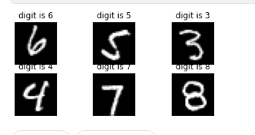

# Handwritten Digit Recognition using Machine Learning and Deep Learning

Handwritten digit recognition  is basically used to detect digits. This project not only detects scanned images but also allows writing digits on the screen. I have used MNIST dataset , it has train and test files  which contain gray-scale images of hand drawn digits from 0 through 9.



## Tools and technologies used

- `MNIST dataset` download from [here](https://www.kaggle.com/competitions/digit-recognizer/data)
- `Kaggle` [get code](https://www.kaggle.com/code/riyabisht/handdigitrecognition)
- `python3`
    - tensorflow
    - matplotlib
    - numpy 
    - pandas
- `streamlit` 

## Achievement  

I have achieved an accuracy of 99%

## Deployment


Have a look [here](https://share.streamlit.io/riyabisht/handwrittendigit_recognition/predict.py) <br>
I have deploy my model on streamlit [find code here](predict.py)  


## install Steamlit on Lunix

* On Ubantu install `python 3`

```
sudo apt-get install python3-pip
```
* install `pipenv`
pipenv - Pipenv is a tool that aims to bring the best of all packaging worlds (bundler, composer, npm, cargo, yarn, etc.) to the Python world. 

```
pip3 install pipenv
```
* Create a new environment with Steamlit
    
    - Navigate to your project folder
    ```
    cd myproject
    ```
    - Create a new Pipenv environment in that folder and activate that environment:
    ```
    pipenv shell
    ```
    `pipefile` will appear in `myprojects/`<br>
    environment and its dependencies are declare in this file.

    - Install Streamlit in your environment 
    ```
    pip install streamlit 
    or
    pipenv install streamlit
    ```
    - Test that the installation worked <br>this  will open in your browser
    ```
    streamlit hello
    ```

## Use your new environment

- Any time you want to use the new environment, you first need to go to your project folder (where the Pipenv file lives) and run:

```
pipenv shell
```
- Now you can use Python and Streamlit as usual:
```
streamlit run predict.py

```